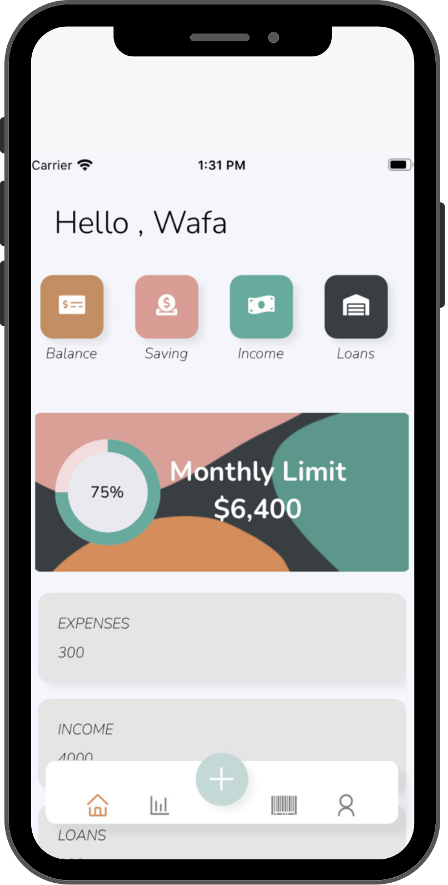
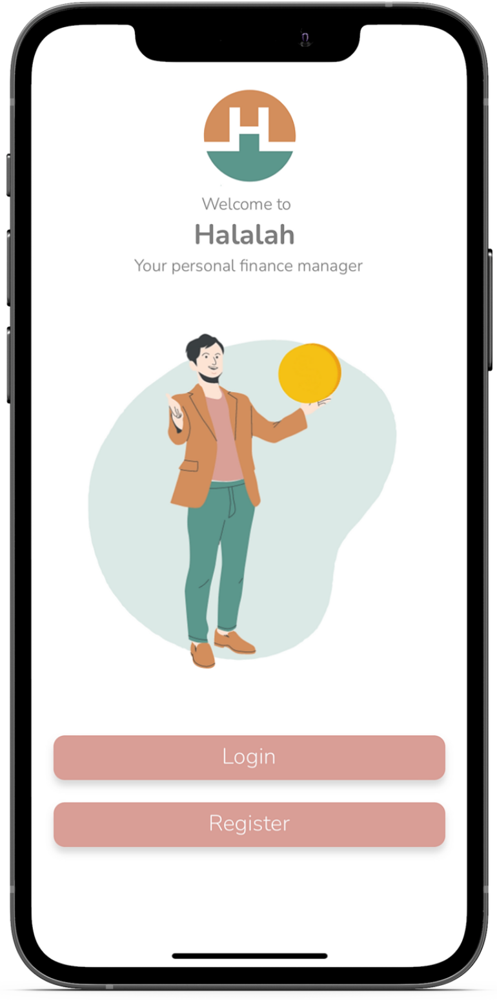
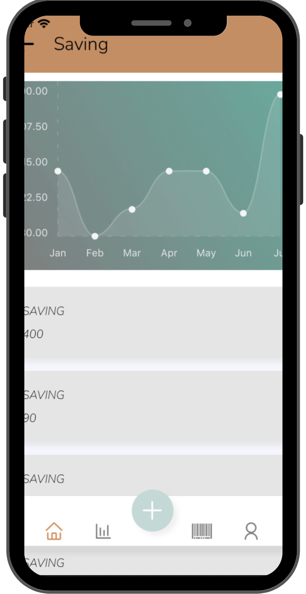

# Halalah app  
<p align="center">

</p>


Halalah app is a personal finance manager that you can access any time under smart phone. is build with React Native, Expo for the frontend and Django for the backend.


## Demo
<p align="center">



</p>


## Prerequisites :
- Python 3
- Virtual env
- Yarn
- Pip
- Node Js
- IOS Samuilter

## Usage and Setup
 
- Clone this repo. Go into the root folder and ```run yarn ```to install the dependencies.

- From the terminal,``` run Expo start```

- Clone the  [Backend repo](https://github.com/Wafa9/Fiance-App-backend) 


## Deployment

To deploy this HalalahApp run

```bash

Clone repo inside app

Cd to app

Login to expo

Change the url to your django url ( helpers -> axiosInstance -> baseURL )

Install the packages ( yarn install )

Run it ( expo start )

```


## Contributing
Pull requests are welcome. For major changes, please open an issue first to discuss what you would like to change.

Please make sure to update tests as appropriate.
